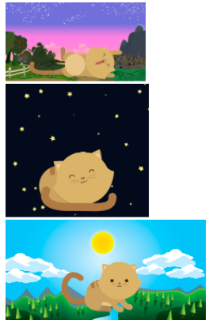

# KITTEN
Crea una página web donde se muestre un paisaje y un gatito diferente a medida que la ventana del navegador se haga más pequeña. El sitio debe verse como en las imágenes.

## Pseudocódigo para Kitten
1. Determinar la posición de las imágenes (fondo/gato).
2. Hacer las pantallas necesarias y dividirlas por media.

# El sitio debe verse como en las imágenes.

